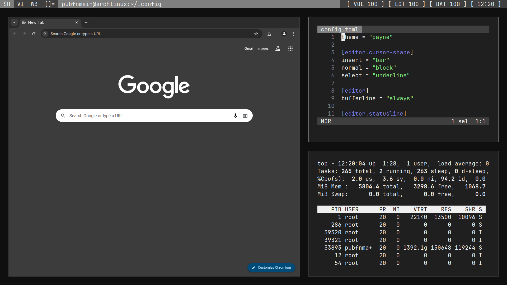

# Dotfiles

- OS: [Arch](https://archlinux.org)
- Compositor: [Dwl](https://codeberg.org/dwl/dwl)
- Status bar: [Ergo](https://github.com/d4yr41n/ergo)
- Font: [JetBrains Mono](https://github.com/JetBrains/JetBrainsMono)
- Menu: [Wmenu](https://codeberg.org/adnano/wmenu)
- Terminal: [Alacritty](https://alacritty.org)
- Text editor: [Helix](https://helix-editor.com)
- Color scheme: Payne (WIP)
- Browser: [Chromium](https://github.com/chromium/chromium)
- Shell: [Ash](https://busybox.net)

